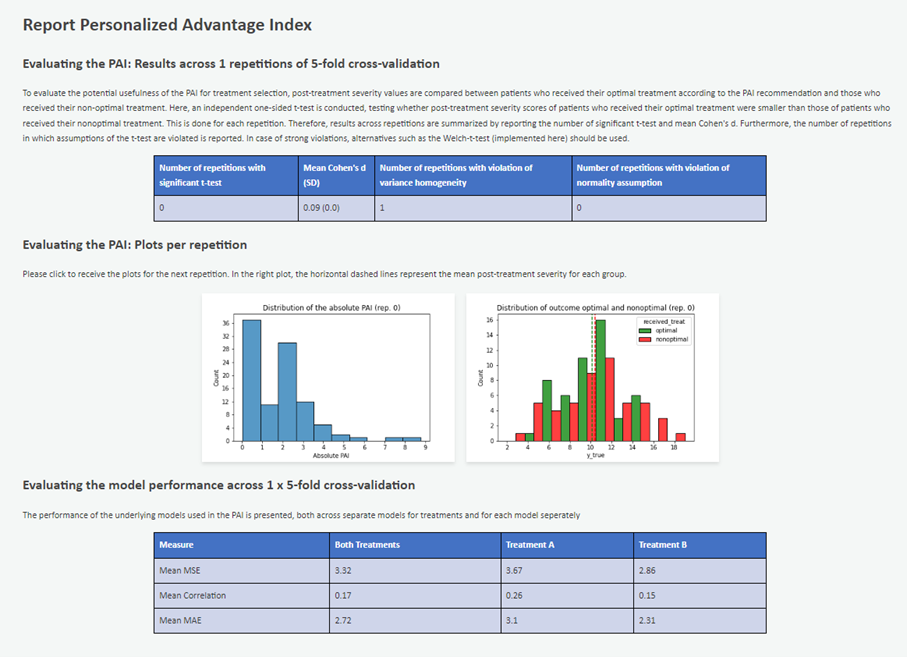

# PAI

The Personalized Advantage Index (PAI) was introduced first by DeRubeis et al. (2014; see References) and is a well-used approach to predict which one of several available treatment alternatives is optimal for an individual patient. The PAI has seen many different implementations. Here, we provide a low-bias pipeline for use by the scientific community.

> ## **ℹ️ Getting Started** 
> Follow these steps to quickly set up the program and run a first analysis using the provided example data:
> 1. **Clone this repository** to your local machine.
> 2. Make sure you have installed the packages numpy, pandas, scikit, and seaborn.
> 3. **Open and run the script "[GUI.py](http://gui.py/)".**
>    1. *Folder with input data*: select "synthet_test_data" folder for using example data.
>    2. Select name and location of results-folder. Leave analysis parameters at default.
> 4. **View results**: after running the script, a overview html-file as well as more detailed summary statistics can be found in the specified results-folder.
>    
>    

# Prepare the script

1. Clone the repository
   
   By cloning the repository, you replicate the entire repository, including all its files and folders, maintaining the same structure on your local computer. If you are not experienced in working with Github, we recommend to use the Github Desktop App: https://docs.github.com/en/desktop/adding-and-cloning-repositories/cloning-a-repository-from-github-to-github-desktop.

   Alternatively, you have the option to manually download the required files and reconstruct the necessary folder structure. If you choose this method, please ensure that you download the following key components: **Main_PAI_advanced_approach.py**, **GUI.py**, the **library** folder, and, if you wish to experiment with the synthetically generated test data, also download the **synth_test_data** folder.
   
2. Make sure all needed requirements are installed.

   a) Manually

      You only need four additional packages (numpy, pandas, scikit, seaborn). Install them manually if you have not installed them yet.
    
    b) Automatically for conda-users, run in the terminal:
    
    ```python
    conda env create -f "YOUR_PATH_TO_THE_ENVIRONMENT\Environment.yaml"
    ```
    If you have not changed the location of the .yaml file after cloning the repository, *YOUR_PATH_TO_THE_ENVIRONMENT* equals *YOUR_PATH_TO_THE_REPOSITORY*
    
    c) Automatically for non-conda-users, run in the terminal:
    
    ```python
    pip install -r "requirements.txt".
    ```

# Prepare the input data

Before running the script, make sure you have three files ready: features.txt, labels.txt, and groups.txt. These files should contain information about features, post-treatment severity, and group membership for all patients.

**General requirements**:

- Put all three files in one folder (and specify the folder path as INPUT_DATA_PATH)
- Make sure that all files are tab-delimited text files (.txt). Usually, tab-delimited text can easily be exported from statistic programs or excel.
- Make sure that a period is used as a decimal separator and avoid special characters in variable names.
- Make sure that variable names are on the top line.

**Specific requirements:**

- **features.txt**: Certain processes in the script hinge on distinguishing feature types (binary, categorical, or dimensional). To facilitate the detection of feature type, recode binary variables as 0.5 and -0.5 and provide categorial variables in string format.

- **groups.txt**: Make sure that it is a binary variable. The format does not matter (string or numerical).

**Address missing values:**

- Do not impute missing values in advance, as this could lead to data leakage.
- The script autonomously handles imputation for missing values marked as NA. Ensure that missing values are denoted appropriately.

    

# Run the script
To calculate the PAI with our low bias approach, the script **"Main_PAI_advanced_approach.py"** needs to be executed.
To execute the script, there are **three methods** available, each requiring the same set of arguments to be provided:

- PATH_INPUT_DATA → The path to the folder which contains features.txt, labels.txt, and groups.txt
- NAME_RESULTS_FOLDER → Name of input data or more general string that will be part of the name of the results folder
- RESULTS_PATH_BASE → Path to store the results folder
- NUMBER_FOLDS → Number of folds in the cross-validation (typically 5 or 10)
- NUMBER_ITERIT → Number of repetitions of the cross-validation (typically 100, choose 1 for a first try)
- CLASSIFIER → Choose ridge_regression OR random_forest
- HP_TUNING → Choose True OR False

## 1. Run script via Graphical User Interface (most simple)
Run the script "GUI.py". A small graphical user interface will launch automatically, allowing you to provide the arguments specified above as input.

## 2. Run script via (anaconda) terminal

a) Open the terminal window in anaconda

b) Run the following command (Replace YOUR_PATH and YOUR_RESULTS_PATH with your own paths)

```python
python "YOUR_PATH\Main_PAI_advanced_approach.py" --NAME_RESULTS_FOLDER test --PATH_INPUT_DATA "YOUR_PATH/PAI_Advanced_Approach/synthet_test_data" --PATH_RESULTS_BASE "YOUR_RESULTS_PATH" --NUMBER_FOLDS 5 --NUMBER_REPETIT 1 --CLASSIFIER ridge_regression --HP_TUNING False
```

## 3. Run script in your IDE (e.g., Spyder)

a) Change the arguments within the script

```python
# Change the arguments here, when running script in IDE
args = parser.parse_args([
   '--PATH_INPUT_DATA', os.path.join(working_directory, "synthet_test_data"),
   '--NAME_RESULTS_FOLDER', "test_run",
   '--PATH_RESULTS_BASE', working_directory,
   '--CLASSIFIER', 'random_forest',
   '--NUMBER_FOLDS', '5',
   '--NUMBER_REPETITIONS', '1',
        ])
```

b) Run the script


# Interpret the results
<details>
<summary> Please find here more information about the created output files here </summary>

## General overview

- HTML-file.html
    
    Nice overview of most important results
    

## Evaluate the usefulness of the PAI

The usefulness of the PAI is retrospectively evaluated by comparing the post-treatment severity of patients that received their optimal treatment vs. those receiving their nonoptimal treatment (according to the PAI). This is typically done with an independent one-sided t-test. All relevant metrics, including the results of tests for the assumptions required by the t-test, and the results of a more robust test, the Welch-test, are presented in the following files:

- PAI_across_repetitions…txt

   **PAI evaluation metrics** for each repetition of the repeated k-fold cross-validation
  
- PAI_summary…txt
  
  **mean** PAI evaluation metrics across repetitions of the repeated k-fold cross-validation
    

Please note that both PAI evaluation outputs are calculated for 4 different subgroups of patients, as indicated by a suffix in the file name:

- _all: all patients
- *50_perc:* 50% of Patients with the highest absolute PAI
- *treat_A: patients that facutally receied treatment A*
- treat_B: patients that facutally received treatment B

Moreover, two types of plots are created, depicting the distribution of post-treatment severity scores for the optimal vs. nonoptimal group and the general distribution of the absolute PAI

## Evaluate the models underlying the PAI

- modelperformance_across_folds.txt
    
    model performance metrics for each fold in the repeated k-fold cross-validation (e.g., RMSE)
    
- modelperformance_summary.txt
    
    **mean** model performance metrics across folds (e.g., **mean** RMSE)
    

## Get more insight into the models underlying the PAI

These files show the feature selection frequency and mean feature importance across folds:

- features_sum_treat_A.txt
- features_sum_treat_B.txt
</details>

# Empirical and theoretical foundations of design choices

There are plenty of different options for preparing the data and the machine learning pipeline. Mostly, no clear data is available suggesting which approches are superior to others. Still, there were some papers that we considered important when designing this pipeline, which are presented below:

- Centering of variables and centering of binary variables to -0.5 and 0.5 -- Kraemer & Blasey (2004)
- Elastic net feature reduction -- Bennemann et al. (2022)
- Random Forest -- Grinsztajn et al (preprint)
- Refraining from LOO-CV and using a repeated 5-fold stratified train-test split -- Varoquaux (2018) & Varoquaux et al. (2017) & Flint et al. (2021) & the observation that prediction performance varies substantially between iterations in our own previous papers, including Leehr et al. (2021) & Hilbert et al. (2021)

# **References**

1. Bennemann et al. (2022). Predicting patients who will drop out of out-patient psychotherapy using machine learning algorithms. The British Journal of Psychiatry, 220, 192–201.
2. DeRubeis et al (2014). The Personalized Advantage Index: translating research on prediction into individualized treatment recommendations. A demonstration. PLOS One, 9(1), e83875.
3. Flint et al. (2021). Systematic misestimation of machine learning performance in neuroimaging studies of depression. Neuropsychopharmacology, 46, 1510–1517.
4. Grinsztajn et al (preprint). Why do tree-based models still outperform deep learning on tabular data? arXiv, 2207.08815.
5. Hilbert et al. (2021). Identifying CBT non-response among OCD outpatients: a machine-learning approach. Psychotherapy Research, 31(1), 52-62.
6. Kraemer & Blasey (2004). Centring in regression analyses: a strategy to prevent errors in statistical inference. International Journal of Methods in Psychiatric Research, 13(3), 141-51.
7. Leehr et al. (2021). Clinical predictors of treatment response towards exposure therapy in virtuo in spider phobia: a machine learning and external cross-validation approach. Journal of Anxiety Disorders, 83, 102448.
8. Varoquaux (2018). Cross-validation failure: Small sample sizes lead to large error bars. NeuroImage, 180(A), 68-77.
9. Varoquaux et al. (2017). Assessing and tuning brain decoders: Cross-validation, caveats, and guidelines. NeuroImage, 145, 166–179.
